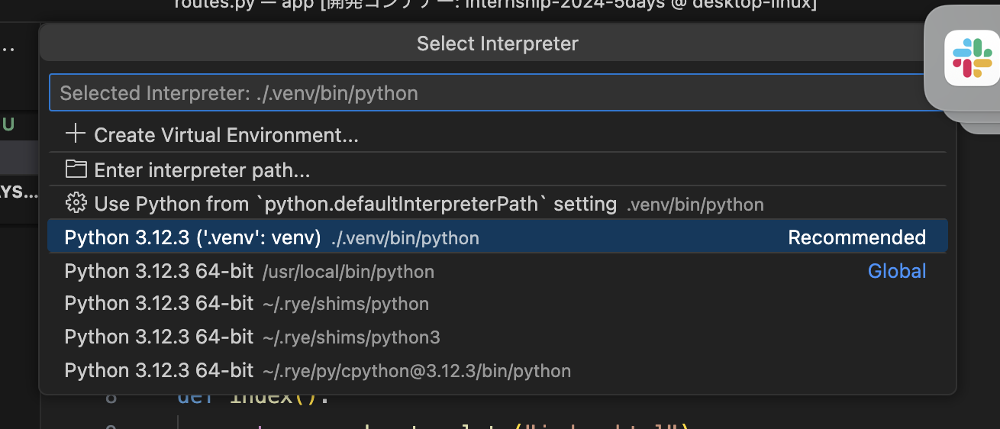

# ニフティ 5days インターン 2024 ベースリポジトリ

このリポジトリはニフティの 5days 開発インターンで利用するテンプレートです。
開発にスムーズに入れるようにするためのテンプレートであって、必ずしもこのスタイルに添う必要はありません。

# 概要

Flask + Bootstrap + MySQL を使用した Web アプリケーションです。
Bootstrap のサンプルとして使えそうなパーツを集めたサンプルページと、必要ならユーザー認証機能を用意しています。

## フォルダ構成

```
.
├── migrations/ # データベースマイグレーションファイル
├── src/
│ ├── web/
│ ├── auth/ # 認証関連のモジュール
│ ├── templates/ # HTMLテンプレート
│ ├── __init__.py
│ ├── app.py # アプリケーションファクトリ
│ ├── config.py # 設定ファイル
│ ├── models.py # データベースモデル
│ └── routes.py # ルーティング
├── pyproject.toml # プロジェクト設定ファイル
└── README.md
```

## 技術スタック

- バックエンド & フロントエンド
  - Python 3.12
  - [Flask 3](https://flask.palletsprojects.com/en/3.0.x/)
  - [Bootstrap 5](https://getbootstrap.com/)
- データベース
  - Flask-SQLAlchemy + Flask-Migrate + MySQL
- パッケージ管理
  - [rye](https://rye.astral.sh/)

## 開発環境の準備方法

このプロジェクトは Visual Studio Code の Dev Container に対応しており、VS Code で開くだけで自動的に環境構築が完了します。基本的に準備していただくものは [Visual Studio Code](https://code.visualstudio.com/) のみで大丈夫です。

1. VS Code に [Dev Containers](https://marketplace.visualstudio.com/items?itemName=ms-vscode-remote.remote-containers) 拡張機能をインストールします。
1. プロジェクトフォルダを VS Code で開きます。
1. 左下の `><` ボタンを押し、現れたメニューから "コンテナで再度開く" (または "Reopen in Container") を選択します。
   - VS Code が Dev Containers を自動的に構築しますが、これには数分かかる場合があります。
   - この過程でなにか問題が発生した場合は遠慮なくメンターに確認してください。
1. VS Code の準備ができたら <http://localhost:18347/> にアクセスできるか確認してください。
   - VS Code の左側にフォルダ構成のツリーが表示されている状態になれば準備はできているはずです。

> [!Note]
>
> VS Code で Python のコードを開いたときに import に大量の赤線が現れる場合はインタプリタを指定してあげる必要があります。VS Code の右下にある、図のようなバージョン表示のボタンをクリックしてください。 (あるいは黄色で「インタプリタを選択」のようなボタンになっているかもしれません。)
> 
> 押すといくつかの選択肢が表示されると思いますが、ここから `.venv/bin/python` が含まれているものを選んでください。
> 

## プロジェクトのカスタマイズ

### 最初に表示される画面の修正

1. src/web/templates/index.html ファイルを編集します。このファイルがホームページのテンプレートです。
1. HTML を修正して、希望するコンテンツや構造に変更します。
1. スタイルを変更したい場合は、CSS ファイルを作成し、テンプレートにリンクします。
1. 動的なコンテンツを追加したい場合は `src/web/routes.py` の index 関数を編集し、必要なデータをテンプレートに渡します。

### ログイン機能の追加

詳しくは[ログイン機能の追加方法](docs/how_to_implement_auth.md)を確認してください。

### データベースの修正

**注意**: マイグレーションファイルは git で共有するので、複数人で同時にデータベースのモデルを修正するタスクを行わないでください。

詳しくは[データベースに追加の情報を保存する方法](docs/how_to_edit_models.md)を参照してください。

### 依存関係の追加

1. `rye add パッケージ名` コマンドを使用して新しい依存関係を追加します。

   - (例) `new-package` パッケージを追加する場合
     ```
     rye add new-package
     ```

1. (それを `git pull` してきた人は) 以下のコマンドを実行して新しい依存関係をインストールします：

   ```
   rye sync
   ```

1. そのままコードを編集すれば適宜新しいパッケージが利用できるようになっているはずです。

   アプリケーションは Python のコードが編集されたタイミングで自動的に再起動されるので、手動で再起動する必要はないはずです。


### FAQ

- Q. `print()` 関数の結果はどこに表示されますか。
  - A. まず `print()` の代わりに `logging.debug()` を利用してください。アプリのログは Docker Desktop のダッシュボードから確認できます。詳しくは[こちらのドキュメント](docs/how_to_debug.md)を参照ください。
- Q. ホットリロードするとログインセッションが保たれません。
  - A. 残念ながら回避することができませんでした...。頻繁にリロードすることになる画面デザイン中は、一旦完成するまで `@login_required` を外すことをおすすめします (`src/web/routes.py` の `secrets()` の実装も参考にしてください) 。
- Q. ユーザー情報にフルネームなど追加の情報を保存したいです。
  - A. 単純にユーザーモデルに追加するのであれば、`src/web/auth/models.py` の `User` モデルを修正し、Flask-Migrate で反映します。[こちらのドキュメント](docs/how_to_add_additional_user_info.md)も参考まで。
